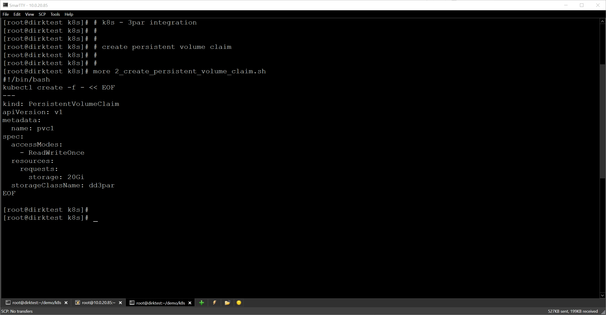

# k8s - 3PAR Integration

## Kubernetes/OpenShift environment
Here is an example of the HPE Docker Volume plugin being used in an OpenShift environment:

### login to 3PAR

### start DORY

### create k8s create StorageClass

### create k8s create Persistent Storage

### create k8s create POD, create file within container, delete container

### create k8s create second POD, and show that the file still exists

